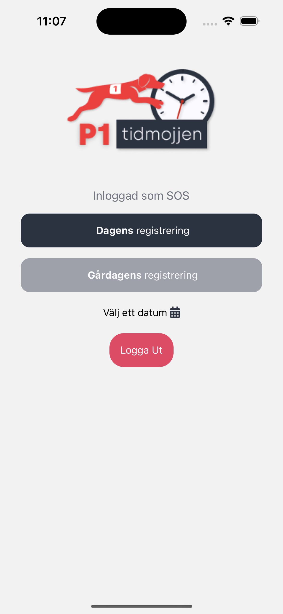
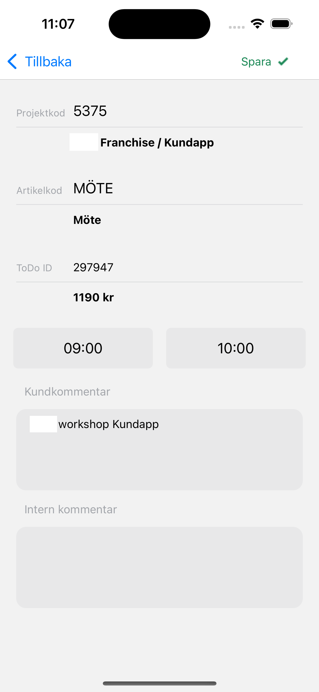
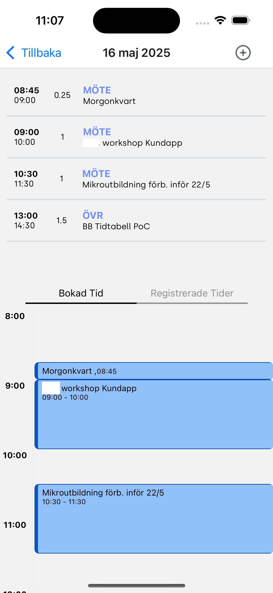
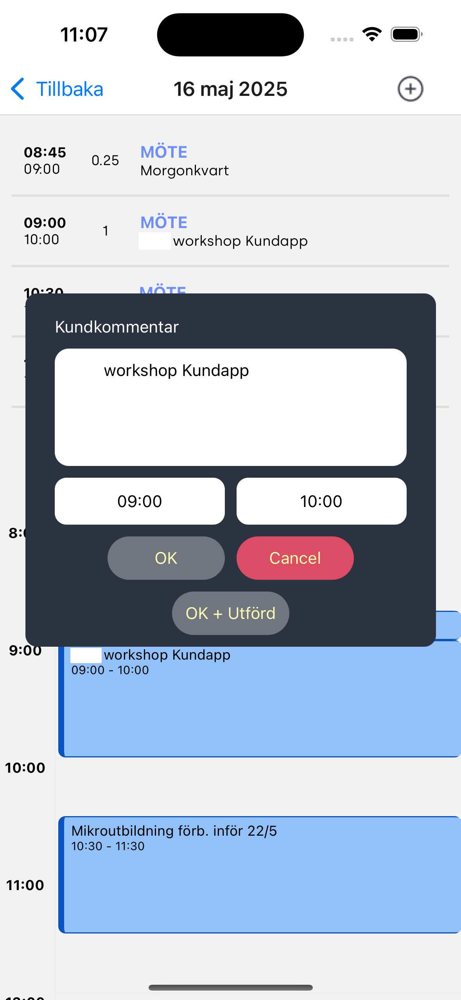
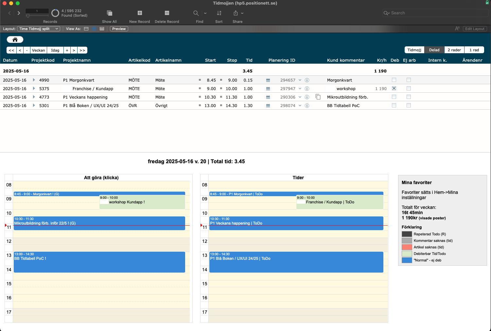
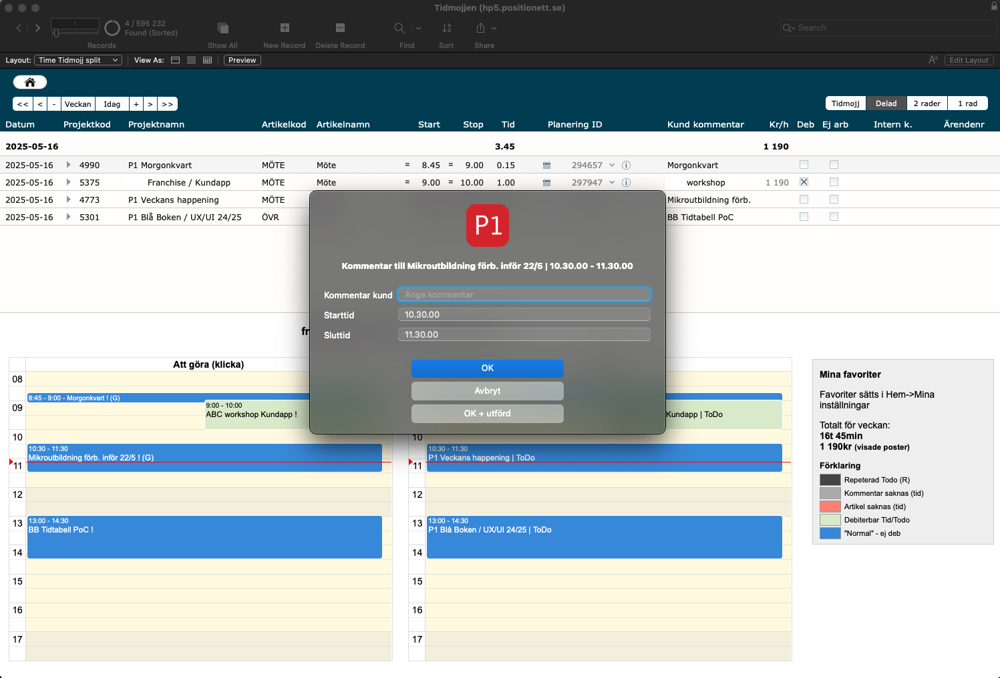

# 📱 TimeRegistrationApp

A mobile proof-of-concept time registration app built with React Native.  
It connects to a FileMaker database through a lightweight PHP Slim 4 API.

This project was developed as part of my graduation work at Chas Academy and served as a deep dive into fullstack mobile development.

---

## 🛠️ Tech Stack

- **React Native** – Frontend mobile app
- **PHP Slim 4** – Middleware REST API
- **FileMaker** – Database (accessed via Data API)
- **Axios** – For HTTP requests
- **Context API & Hooks** – For state management

---

## 📸 Screenshots

### 🏠 Home Screen  

### ⏱️ Time Entry  

### 📅 Timeline View  

### ➕ New Post Screen  

### Destkop Version

### Desktop Version 2

---

## 🚀 Features

- Time registration UI optimized for quick daily input
- Simple and clean interface design
- Handles simpler user identification, time entries, and activity logging
- Communicates with FileMaker securely through a backend API

---

## 📁 Project Structure

